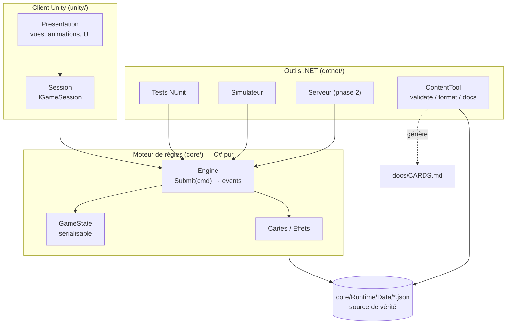
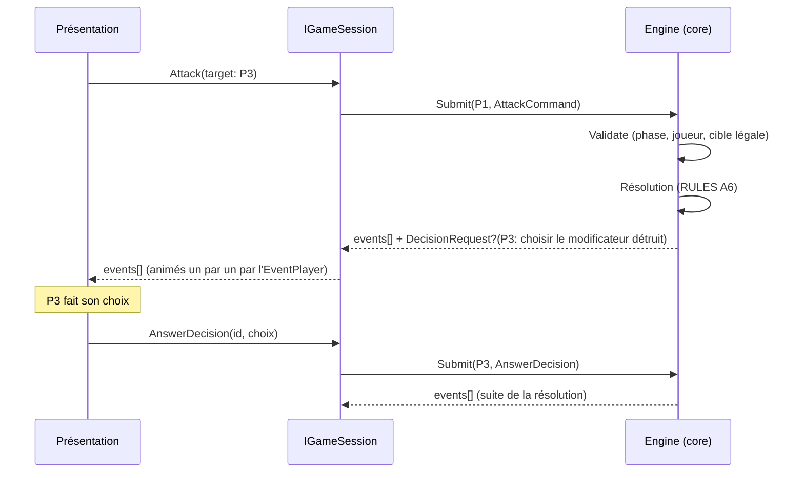
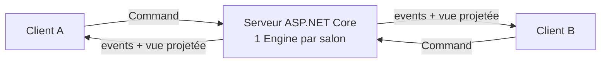

# Architecture

> Ce document décrit **comment** le code est organisé et **pourquoi**. Les décisions structurantes sont détaillées dans les ADR ([`docs/adr/`](adr/)).

## 1. Vue d'ensemble

Le projet a trois couches, qui dépendent **uniquement vers le bas** :

- **`core/`** contient toutes les règles, et rien d'autre : pas de `UnityEngine`, pas d'I/O, pas d'horloge, pas d'aléatoire non maîtrisé. C'est un package UPM local, compilé à la fois par Unity et par .NET 10 (ADR-0002).
- **`unity/`** affiche l'état et envoie les intentions du joueur. Il ne décide d'**aucune** règle.
- **`dotnet/`** regroupe les tests, l'outil de contenu, le simulateur d'équilibrage (`Vortex.Simulator`, rapports dans `docs/balance/`) et, plus tard, le serveur.

## 2. Flux d'une action

- **Commande** : c'est une *intention* (« je veux attaquer P3 »). Elle peut être refusée, auquel cas le moteur renvoie une erreur typée, jamais une exception.
- **Événement** : c'est un *fait accompli* (« P3 perd 4 PV »). La présentation se contente de le jouer.
- **Décision** : quand la résolution a besoin d'un choix, parfois d'un **autre** joueur que le joueur actif, le moteur renvoie l'état d'avant la commande avec un `DecisionRequest`. Chaque réponse ré-exécute la commande depuis cet état. C'est déterministe, parce que le hasard vient de l'état lui-même. L'état reste ainsi sérialisable à tout instant (ADR-0009).

## 3. Moteur (`core/Runtime`)

| Dossier | Contenu |
|---|---|
| `Content/` | Définitions statiques (`CardDefinition`, `EventDefinition`, `TechnologyDefinition`, `GameData`), `ContentJson` et `GameDataLoader` (chargement durci), `GameDataValidator`. **Implémenté en M0.** |
| `Data/` | **Source de vérité** du contenu : `cards.json`, `events.json`, `technologies.json`, avec leurs JSON Schemas (`schema/`) pour l'édition (ADR-0008). |
| `Config/` | `GameConfig` (lu depuis `Data/config.json`) : toutes les valeurs ⚙ des règles. **M1.** |
| `State/` | `GameState`, `PlayerState`, `CardInstance`, `MarketState`, `StatusState`, `PendingState`. Des POCO sérialisables avec des `Clone()` explicites. **M1.** |
| `Cards/` | Réservé aux éventuelles classes de cartes exotiques, que les briques ne peuvent pas exprimer. **Vide à ce jour.** C'est le seul dossier autorisé à citer un id de carte (test `Engine_code_never_references_a_specific_card`). |
| `Effects/` | Classe de base `Effect` (points d'interception B2), `ValueModifiers` (empilement B4), `EffectCatalog` (compile les effets du contenu). `Bricks/` : le catalogue fermé des briques (`BrickCatalog`) et leurs paramètres typés (`BrickParams`). `Statuses/` : les statuts génériques (B5). **M1-M2.** |
| `Commands/`, `Events/`, `Decisions/` | Contrat d'entrée et de sortie du moteur. Ce même contrat servira au réseau. Ce sont des types **plats**, sans polymorphisme, donc sans risque de désérialisation polymorphe. **M1.** |
| `Dice/` | `Pcg32`, le générateur déterministe (ADR-0004). **M1.** |
| `Rules/` | `GameEngine` (API publique sans état), `Game` (contexte de résolution, découpé en `Game.Actions`, `Game.Flow`, `Game.Commands` et `Game.Attack`), `GameStateValidator` (invariants). **M1.** Aperçus : `GameEngine.Preview` joue une commande sur des parties supposées et en résume l'effet dans un `CommandPreview` (ADR-0018). `GameEngine.Explain` dit pourquoi un coup est refusé, sans rien jouer ; quand une permission le refuse, l'erreur nomme l'effet responsable (`SourceKind`, `SourceId`). **M4.5.** |
| `Projection/` | `GameView.Of(state)`, la vue publique sans informations cachées (ordre des paquets, état du RNG). **M1.** `HiddenInformation.Guess(state, guesses)` remplace cette information cachée par une supposition, pour les bots et les aperçus (ADR-0010, ADR-0018). |
| `Bots/` | `IBot`, `RandomBot` et `HeuristicBot` (ADR-0010) : bots génériques qui ne connaissent aucune carte et ne voient pas l'information cachée. `BotFactory` crée les quatre niveaux (`BotLevel` : `random`, `naive`, `normal`, `strong`). Le bot note sa protection effective, calculée par le moteur (ADR-0012). Ils servent au simulateur, et plus tard d'IA ou de remplaçants pour un joueur inactif. **M3.** |

### Comportement des cartes
- **Le moteur ne connaît aucune carte** (ADR-0007). Les règles de base exposent des points d'interception (calculs, autorisations, réactions : RULES B2), et les effets agissent par des actions élémentaires (RULES B3), qui appliquent elles-mêmes les autorisations. L'empilement est générique (RULES B4).
- Les **données** (nom, texte, arbitrage, couleur, emplacement, usage, nombre d'exemplaires et, à partir de M2, briques d'effets) viennent de `core/Runtime/Data/*.json`.
- Le **comportement** d'une carte courante est déclaré par des **briques d'effets** paramétrées dans le JSON (catalogue fermé, en liste blanche). Pour une carte exotique, c'est une petite classe C#. Elle redéfinit uniquement les points d'accroche utiles : `ModifyAttackValue`, `OnDamageTaken`, `OnTurnStart`…
- L'enregistrement passe par un **registre statique explicite**, sans réflexion (ADR-0006).

### Ordre déterministe
Défini une seule fois, dans RULES B7 :
1. d'abord les effets globaux ;
2. puis le joueur actif et les autres dans le sens horaire ;
3. pour chaque joueur : l'emplacement ATK, puis DEF, puis les effets temporaires.

Les chaînes de réactions sont bornées à 16 niveaux.

## 4. Simulateur d'équilibrage (`dotnet/Vortex.Simulator`)

Outil de développement, jamais embarqué dans un build. Il joue des parties bot contre bot avec le vrai moteur et écrit un rapport markdown en français (mode d'emploi : [`balance/README.md`](balance/README.md), décision : ADR-0011).

| Fichier | Rôle |
|---|---|
| `Program.cs` | Commandes `run` (rapport complet), `compare` (référence contre variantes) et `grid` (combinaisons classées selon les objectifs), options validées, parties jouées en parallèle avec une graine par partie. |
| `Variants.cs` | Charge la référence et applique les **variantes** (correctifs JSON), puis revalide le tout avec le chargeur du jeu. Calcule l'empreinte du contenu simulé. |
| `GameRunner.cs` | Joue une partie et relève ses mesures (`GameRecord`) à partir des événements du moteur. |
| `Stats.cs` | Agrège un lot de parties (`ScenarioStats`) : proportions et moyennes avec leur erreur type. |
| `Grid.cs` | Charge une **grille** : produit cartésien de correctifs, objectifs chiffrés, classement par distance aux objectifs. |
| `Report.cs`, `CompareReport.cs`, `GridReport.cs` | Mise en forme des trois types de rapport. |

**Reproductibilité** : la graine de chaque partie dépend seulement de la graine globale, du nombre de joueurs et du numéro de la partie. Le résultat ne dépend donc pas de l'ordonnancement des threads, et la référence et ses variantes jouent les mêmes parties.

## 5. Client Unity (`unity/`)

Le projet utilise Unity 6 et URP (version : ADR-0013). Tout le code du jeu est dans `unity/Assets/_Vortex/`. Architecture de présentation : ADR-0014. Scène de jeu (3D à caméra fixe, interface 2D sans logique de règles) : ADR-0015. Ce que voit le joueur : [`INTERFACE.md`](INTERFACE.md).

| Dossier | Assembly | Rôle |
|---|---|---|
| `Scripts/Content/` | `Vortex.Client` | `GameContent` : les fichiers de contenu du moteur, référencés comme assets texte et donc embarqués dans les builds, chargés par le chargeur validant du moteur. `TextTable` : les textes de l'interface par clé (`TextKeys`), en français seulement pour l'instant (ADR-0015). |
| `Scripts/Theme/` | `Vortex.Client` | Habillage : `ThemeSettings` (couleurs, polices, icônes du texte, vitesse), `CardArtCatalog` (illustration par identifiant de contenu), `ShipCatalog` (vaisseau par siège), visuels provisoires générés (`PlaceholderArt`, `PlaceholderShip`), conversion du texte des cartes en texte enrichi (`CardText`). |
| `Scripts/Session/` | `Vortex.Client` | `IGameSession` : la présentation ne connaît que la vue publique, le joueur qui doit agir, les commandes légales, la soumission d'une commande et l'aperçu d'une commande (ADR-0018). `LocalHotSeatSession` en phase 1 (bots possibles sur tout siège, joués pas à pas), `NetworkSession` en phase 2. `MatchSetup` (sièges, graine, `RuleOptions`) décrit la partie à lancer. |
| `Scripts/Menus/` | `Vortex.Client` | Menus hors partie et en partie (INTERFACE §5, ADR-0019) : `MainMenu` (accueil), `LocalGameMenu` et `SeatRow` (partie locale), `DevMenu` (options de règles et graine, développement seulement), `OptionsMenu` et `UserOptions` (options de l'appareil, gardées avec `PlayerPrefs` et vérifiées à la relecture), `PauseMenu`, `GameOverPanel`. `MatchLauncher` porte la partie choisie de la scène `Menu` à la scène `Game`. |
| `Scripts/Presentation/` | `Vortex.Client` | `EventPlayer` (joue les événements un par un), retours visuels (`FeedbackAsset`, `PauseFeedback`, `PrefabFeedback`), `FeedbackProfile` (quel retour pour quel événement). `CardDisplay` : une carte en **objet 3D** (corps à la couleur de sa technologie, illustration, textes TextMeshPro 3D, jetons de Tourment), remplie depuis un `CardFace` ; `CardAnchor` la garde sur sa place de l'interface, face à la caméra (ADR-0017). `DiceFeedback` et `DiceTray` : les dés d'un lancer, qui roulent puis s'arrêtent sur les valeurs du moteur ; chaque dé est un d8 en 3D (`DieSpinner`) qui suit sa place dans le plateau. Animations (ANIMATIONS.md) : `AimFeedback`, `LaserFeedback` (avec `ProjectileFlight` pour un projectile modélisé), `KnockbackFeedback`, `ThrusterFeedback`, `ExplosionFeedback`, avec des effets provisoires en formes simples (`PlaceholderEffect`) et les repères des modèles (`ShipParts`) ; `ShipMotion` fait balancer chaque vaisseau et porte ses reculs. Combat (lot 2) : `DeflectFeedback`, `CriticalFeedback`, `DodgeFeedback`, `ShieldPulseFeedback`, la sphère du bouclier (`ShieldBubble`), la secousse de la caméra (`CameraShake`) et la fumée d'un vaisseau endommagé (`HullDamage`) ; `AttackMemory` garde ce que les événements d'une attaque ont dit (déviation, critique, dégâts) jusqu'au tir. Un retour visuel qui s'anime lui-même suit la vitesse de lecture (`IFeedbackStage.PlaybackSpeed`). |
| `Scripts/Presentation/Table/` | `Vortex.Client` | La table de jeu (INTERFACE §3) : `GameDirector` (lance la session, place les sièges, joue les événements, fait jouer les bots), `TableModel` (ce que montre la table, qui suit les événements un par un, marchés compris), `SeatLayout` (ordre des adversaires), `GameLogFormatter` (lignes du journal), et les affichages `SeatDisplay`, `MarketDisplay` (qui se réduit hors de la phase de marché, ARB-81), `RoundBanner`, `GameLogDisplay`, `PlaybackControls`, `ScreenAnchor`. `CommandPanel` : un bouton par commande légale (panneau du mode test, désactivé par défaut) ou par réponse d'une décision que la table ne saurait pas montrer ; `CommandLabels` : leurs libellés, tirés de la vue publique et des textes. Lisibilité : `CardZoom` et `CardHover` (carte agrandie quand on pointe une carte de la table). Gestes (M4.5) : `PlayerControls` traduit chaque geste en l'une des commandes permises par le moteur. Les briques de ces gestes sont `ActionButton` (actions d'équipage, disposées en arc centré sur le vaisseau par `ActionArc`), `CardDrag` (glisser une carte), `HelpBubble` (aide au survol), et les points d'accroche de `MarketDisplay` (achat) et de `SeatDisplay` (utilisation d'une carte, cibles, survol). `TurnAnnouncement` affiche « Tour de X » quand la vue pivote vers un autre humain (M4.6). `HoverIntent` décide quand montrer ce qu'un survol montre : tout de suite à la souris, après un appui long au doigt (le type de pointeur vient du paquet Input System) ; `CardHover`, `ActionButton`, `SeatDisplay` et `HoverHelp` (aide du combo et du jeton de surcharge) s'en servent. `RefusalText` met en mots la raison d'un refus donnée par le moteur, et `SourceNames` le nom d'une carte, d'un statut ou d'une règle. `IControlsHost` relie les commandes à la table. Décisions sur la table (ARB-82) : `DecisionChoices` place chaque option d'une décision (un siège, une carte, un nombre, un contenu, une action, un glisser) d'après ce qu'elle nomme, sans connaître aucune carte ; `DecisionBoard` montre la question, les faces de d8 et les cartes du centre ; `CardTap` rend une carte 3D touchable. Temps de tour (ARB-80) : `TurnClock` compte le temps de celui qui peut agir, `TurnTimerDisplay` le montre ; à l'expiration, `LocalHotSeatSession.Expire` termine le tour ou fait répondre un bot. Pendant la visée d'une attaque ou d'un sabotage, `PreviewText` met en mots l'aperçu calculé par le moteur, affiché dans la bulle d'aide près de la cible (ADR-0018). |
| `Scripts/Gallery/` | `Vortex.Client` | `GalleryController` : la scène Galerie, pour régler l'apparence sans jouer une partie. |
| `Editor/` | `Vortex.Editor` (éditeur seul) | Création des assets de base (`ProjectAssets`, `ThemeAssets`, `GalleryScene`, `GameScene`, `MenuScene`, avec `UiBuilder`, `MenuBuilder` et `SceneFiles` ; `BuildSceneList` tient la liste des scènes du build : `Menu`, puis `Game`), règles d'import des illustrations, des icônes et des modèles (`ArtImportRules`), captures de scène en mode batch (`SceneCapture`), réponse aux décisions pour les tests et les captures (`TableAnswers`), configuration de Unity MCP, garde-fou des builds de publication (`ReleaseBuildGuard`). |
| `Tests/EditMode/` | `Vortex.Tests.EditMode` | Tests exécutés dans Unity : moteur et contenu réel, session, lecture des événements, habillage, import des illustrations, galerie, conventions. |
| `Content/`, `Theme/`, `Prefabs/`, `Scenes/`, `Art/`, `Presentation/Feedback/` | — | Assets : contenu du jeu et textes de l'interface, thème et catalogues, prefabs de carte et de panneau d'adversaire, scènes `Menu` et `Game` (celles du build) et `Gallery`, illustrations et modèles déposés, profil de retours visuels. |

**Nommage** : le moteur appelle `*View` ses vues publiques (`GameView`, `PlayerView`, `CardView`…). Les composants Unity qui les affichent s'appellent `*Display`, pour que les deux ne se confondent jamais.

**Ce que montre la table pendant la lecture** : le moteur résout une commande d'un coup. Pendant que ses événements sont joués un par un, `TableModel` les suit : PV, bouclier, surcharge, éliminations, technologies, manche et joueur en cours changent à l'écran quand leur événement passe. Les marchés suivent aussi leurs événements (carte prise, révélée, marché recyclé), qui donnent la place de chaque carte : une décision parmi des cartes tout juste révélées les trouve sur la table. Les cartes équipées et les effets temporaires se recalent sur la vue publique quand la lecture est finie. Deux exceptions, testées :
- les événements d'ouverture de la partie ne sont pas rejoués sur le modèle, car la session n'a que la vue d'après ;
- tant qu'une commande attend une décision, la vue publique est encore l'état d'avant la commande (ADR-0009). Le modèle continue donc de suivre les événements et ne se recale qu'une fois la commande terminée.

**Outils en ligne de commande** (`tools/`) : tests Unity, création des assets de base et captures de scène en mode batch, qui partagent `UnityCommon.ps1` ; export des modèles Blender vers FBX (`tools/blender/export_unity.py`, ADR-0016).

**Couches d'affichage** (ADR-0017) : l'interface est dessinée par la caméra à 10 unités ; les cartes 3D sont à 6 unités, donc devant ses panneaux ; la carte agrandie est à 3 unités ; le calque de premier plan (*overlay* : dés, question d'une décision, faces de d8, bulle d'aide, fenêtres) reste au-dessus de tout.

**Disposition** : les vaisseaux sont placés par leur position **à l'écran** (réglages *Disposition* de `GameDirector`) : un rayon part de la caméra et touche la table. Les panneaux des adversaires suivent leur vaisseau (`ScreenAnchor`).

Les ressources de TextMeshPro (police LiberationSans, shaders, réglages) sont versionnées dans `unity/Assets/TextMesh Pro/`. Elles sont extraites du paquet uGUI épinglé, avec leurs identifiants Unity, sans les deux shaders HDRP, inutiles avec URP.

Le moteur (`core/`) est un paquet local du projet (`file:../../core`) : Unity compile exactement le même code que les tests .NET et le simulateur.
- **Habillage** : les catalogues associent les ids du moteur aux assets ; un asset manquant est remplacé par un visuel provisoire généré. Voir `CONTRIBUTING.md` › *Ajouter ou modifier un visuel*.

## 6. Réseau (phase 2, prévu mais non implémenté)

- Le serveur exécute le **même** `core`. Les clients n'envoient que des commandes, et la validation est identique à celle du jeu local.
- Chaque client ne reçoit que sa **projection** (`StateProjection`).
- Détails et mesures de sécurité : [`SECURITY.md`](SECURITY.md).
