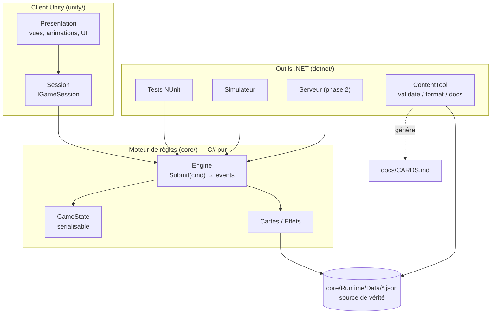
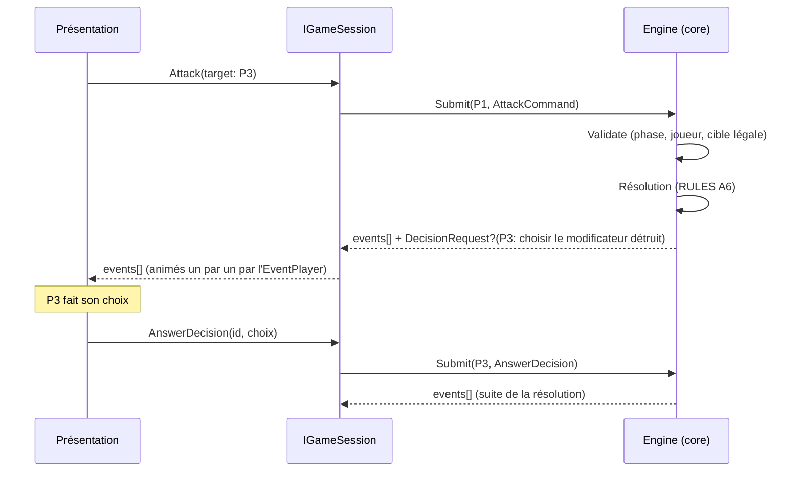
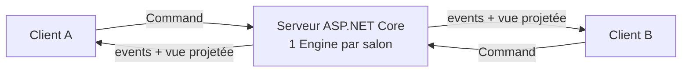

# Architecture

> Ce document décrit **comment** le code est organisé et **pourquoi**. Les décisions structurantes sont détaillées dans les ADR ([`docs/adr/`](adr/)).

## 1. Vue d'ensemble

Le projet a trois couches, qui dépendent **uniquement vers le bas** :

- **`core/`** contient toutes les règles, et rien d'autre : pas de `UnityEngine`, pas d'I/O, pas d'horloge, pas d'aléatoire non maîtrisé. C'est un package UPM local, compilé à la fois par Unity et par .NET 10 (ADR-0002).
- **`unity/`** affiche l'état et envoie les intentions du joueur. Il ne décide d'**aucune** règle.
- **`dotnet/`** regroupe les tests, l'outil de contenu, le simulateur d'équilibrage et, plus tard, le serveur.

## 2. Flux d'une action

- **Commande** : c'est une *intention* (« je veux attaquer P3 »). Elle peut être refusée, auquel cas le moteur renvoie une erreur typée, jamais une exception.
- **Événement** : c'est un *fait accompli* (« P3 perd 4 PV »). La présentation se contente de le jouer.
- **Décision** : quand la résolution a besoin d'un choix, parfois d'un **autre** joueur que le joueur actif, le moteur renvoie l'état d'avant la commande avec un `DecisionRequest`. Chaque réponse ré-exécute la commande depuis cet état. C'est déterministe, parce que le hasard vient de l'état lui-même. L'état reste ainsi sérialisable à tout instant (ADR-0009).

## 3. Moteur (`core/Runtime`)

| Dossier | Contenu |
|---|---|
| `Content/` | Définitions statiques (`CardDefinition`, `EventDefinition`, `TechnologyDefinition`, `GameData`), `ContentJson` et `GameDataLoader` (chargement durci), `GameDataValidator`. **Implémenté en M0.** |
| `Data/` | **Source de vérité** du contenu : `cards.json`, `events.json`, `technologies.json`, avec leurs JSON Schemas (`schema/`) pour l'édition (ADR-0008). |
| `Config/` | `GameConfig` (lu depuis `Data/config.json`) : toutes les valeurs ⚙ des règles. **M1.** |
| `State/` | `GameState`, `PlayerState`, `CardInstance`, `MarketState`, `StatusState`, `PendingState`. Des POCO sérialisables avec des `Clone()` explicites. **M1.** |
| `Cards/` | `CardRegistry` (id → comportement) et les classes des cartes exotiques. **Seul dossier** autorisé à citer un id de carte (test `Engine_code_never_references_a_specific_card`). |
| `Effects/` | Points d'interception (RULES B2), actions élémentaires (B3), empilement (B4), durées (B5) et catalogue des briques d'effets. |
| `Commands/`, `Events/`, `Decisions/` | Contrat d'entrée et de sortie du moteur. Ce même contrat servira au réseau. Ce sont des types **plats**, sans polymorphisme, donc sans risque de désérialisation polymorphe. **M1.** |
| `Dice/` | `Pcg32`, le générateur déterministe (ADR-0004). **M1.** |
| `Rules/` | `GameEngine` (API publique sans état), `Game` (contexte de résolution, découpé en `Game.Actions`, `Game.Flow`, `Game.Commands` et `Game.Attack`), `GameStateValidator` (invariants). **M1.** |
| `Projection/` | `GameView.Of(state)`, la vue publique sans informations cachées (ordre des paquets, état du RNG). **M1.** |
| `Bots/` | `RandomBot` et `HeuristicBot`, pour le simulateur et plus tard pour remplacer un joueur inactif. |

### Comportement des cartes
- **Le moteur ne connaît aucune carte** (ADR-0007). Les règles de base exposent des points d'interception (calculs, autorisations, réactions : RULES B2), et les effets agissent par des actions élémentaires (RULES B3), qui appliquent elles-mêmes les autorisations. L'empilement est générique (RULES B4).
- Les **données** (nom, texte, arbitrage, couleur, emplacement, usage, nombre d'exemplaires et, à partir de M2, briques d'effets) viennent de `core/Runtime/Data/*.json`.
- Le **comportement** d'une carte courante est déclaré par des **briques d'effets** paramétrées dans le JSON (catalogue fermé, en liste blanche). Pour une carte exotique, c'est une petite classe C#. Elle redéfinit uniquement les points d'accroche utiles : `ModifyAttackValue`, `OnDamageTaken`, `OnTurnStart`…
- L'enregistrement passe par un **registre statique explicite**, sans réflexion (ADR-0006).

### Ordre déterministe
Défini une seule fois, dans RULES B7 :
1. d'abord les effets globaux ;
2. puis le joueur actif et les autres dans le sens horaire ;
3. pour chaque joueur : l'emplacement ATK, puis DEF, puis les effets temporaires.

Les chaînes de réactions sont bornées à 16 niveaux.

## 4. Client Unity (`unity/`)

- `Session/` : `IGameSession`, avec `LocalHotSeatSession` en phase 1 et `NetworkSession` en phase 2. La présentation ne connaît que l'interface.
- `Presentation/` : `EventPlayer` (joue les événements un par un), vues (vaisseau, carte, marché, dé, jetons), UI des phases et fenêtres de décision.
- **Habillage** : les catalogues ScriptableObject (`ThemeSettings`, `CardArtCatalog`, `ShipCatalog`…) associent les ids du moteur aux assets. Un asset manquant est remplacé par un placeholder généré. Voir `CONTRIBUTING.md` › *Ajouter ou modifier un visuel*.

## 5. Réseau (phase 2, prévu mais non implémenté)

- Le serveur exécute le **même** `core`. Les clients n'envoient que des commandes, et la validation est identique à celle du jeu local.
- Chaque client ne reçoit que sa **projection** (`StateProjection`).
- Détails et mesures de sécurité : [`SECURITY.md`](SECURITY.md).
