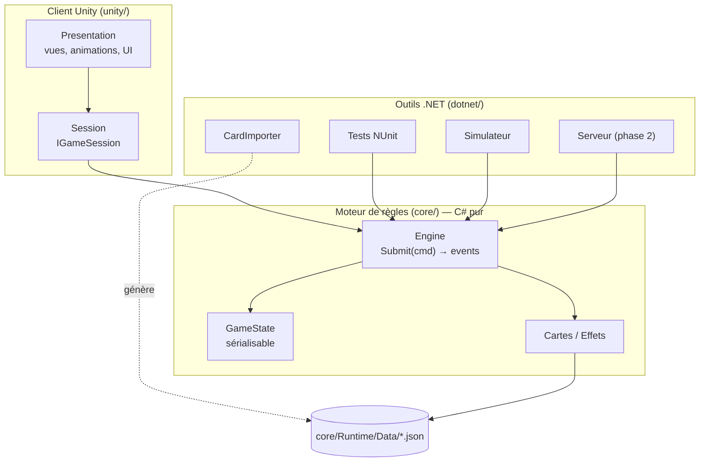
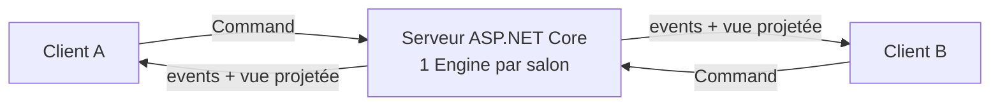

# Architecture

> Ce document décrit **comment** le code est organisé et **pourquoi**. Les décisions structurantes sont détaillées dans les ADR ([`docs/adr/`](adr/)).

## 1. Vue d'ensemble

Le projet a trois couches, qui dépendent **uniquement vers le bas** :

- **`core/`** contient toutes les règles, et rien d'autre : pas de `UnityEngine`, pas d'I/O, pas d'horloge, pas d'aléatoire non maîtrisé. C'est un package UPM local, compilé à la fois par Unity et par .NET 10 (ADR-0002).
- **`unity/`** affiche l'état et envoie les intentions du joueur. Il ne décide d'**aucune** règle.
- **`dotnet/`** regroupe les tests, le simulateur d'équilibrage, l'import des cartes et, plus tard, le serveur.

## 2. Flux d'une action

- **Commande** : c'est une *intention* (« je veux attaquer P3 »). Elle peut être refusée, auquel cas le moteur renvoie une erreur typée, jamais une exception.
- **Événement** : c'est un *fait accompli* (« P3 perd 4 PV »). La présentation se contente de le jouer.
- **Décision** : quand la résolution a besoin d'un choix, parfois d'un **autre** joueur que le joueur actif, le moteur se met en pause sur un `DecisionRequest`. Il reprend à la réception de `AnswerDecision`. La file de résolution est une structure de données sérialisable, et non une coroutine, ce qui rend l'état sauvegardable à tout instant (ADR-0005).

## 3. Moteur (`core/Runtime`)

| Dossier | Contenu |
|---|---|
| `Content/` | Définitions statiques (`CardDefinition`, `EventDefinition`, `TechnologyDefinition`, `GameData`), `GameDataSerializer` (chargement durci) et `GameDataValidator`. **Implémenté en M0.** |
| `Data/` | `gamedata.json`, **généré** par `Vortex.CardImporter` à partir de `design/Vortex.xlsx`. On ne le modifie jamais à la main : un test et la CI vérifient qu'il correspond au classeur. |
| `Config/` | `GameConfig` et ses presets par nombre de joueurs. Toutes les valeurs d'équilibrage y sont. |
| `State/` | `GameState`, `PlayerState`, `SlotState`, `MarketState`, `DeckState`, statuts temporaires. Des POCO sérialisables. |
| `Cards/` | `CardDefinition` (données issues du JSON), `CardRegistry` (id → comportement) et une classe par carte. |
| `Effects/` | Points d'accroche (`ICardBehaviour`), pipeline d'attaque et modificateurs. |
| `Commands/`, `Events/`, `Decisions/` | Contrat d'entrée et de sortie du moteur. Ce même contrat servira au réseau. |
| `Dice/` | `Pcg32`, le générateur déterministe (ADR-0004). |
| `Engine/` | `GameEngine`, machine à états manche → tour → phases, et file de résolution. |
| `Projection/` | `StateProjection.ForViewer()`, la vue publique sans informations cachées (ordre des paquets, état du RNG). |
| `Bots/` | `RandomBot` et `HeuristicBot`, pour le simulateur et plus tard pour remplacer un joueur inactif. |

### Comportement des cartes
- Les **données** (nom, texte, couleur, emplacement, usage, nombre d'exemplaires, paramètres numériques) viennent du JSON généré depuis `design/Vortex.xlsx`.
- Le **comportement** est une petite classe C# par carte. Elle redéfinit uniquement les points d'accroche utiles : `ModifyAttackValue`, `OnDamageTaken`, `OnTurnStart`…
- L'enregistrement passe par un **registre statique explicite**, sans réflexion (ADR-0006).

### Ordre déterministe
Quand plusieurs effets réagissent au même moment, l'ordre est le suivant :
1. le joueur actif d'abord, puis les autres dans le sens horaire ;
2. pour chaque joueur, l'emplacement ATK, puis DEF, puis les statuts temporaires.

## 4. Client Unity (`unity/`)

- `Session/` : `IGameSession`, avec `LocalHotSeatSession` en phase 1 et `NetworkSession` en phase 2. La présentation ne connaît que l'interface.
- `Presentation/` : `EventPlayer` (joue les événements un par un), vues (vaisseau, carte, marché, dé, jetons), UI des phases et fenêtres de décision.
- **Habillage** : les catalogues ScriptableObject (`ThemeSettings`, `CardArtCatalog`, `ShipCatalog`…) associent les ids du moteur aux assets. Un asset manquant est remplacé par un placeholder généré. Voir `CONTRIBUTING.md` › *Ajouter ou modifier un visuel*.

## 5. Réseau (phase 2, prévu mais non implémenté)

- Le serveur exécute le **même** `core`. Les clients n'envoient que des commandes, et la validation est identique à celle du jeu local.
- Chaque client ne reçoit que sa **projection** (`StateProjection`).
- Détails et mesures de sécurité : [`SECURITY.md`](SECURITY.md).
